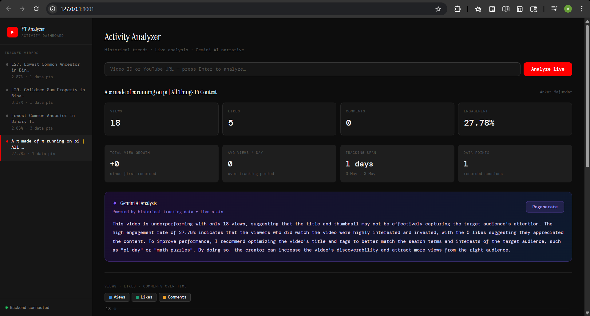
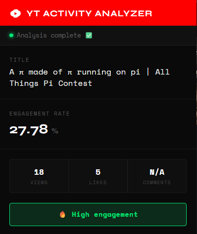

# 🎬 YouTube Activity Analyzer

A full-stack YouTube analytics system that **passively tracks every video you watch**, builds a historical performance database, and delivers AI-powered insights — all running locally on your machine.

> Built with a Chrome Extension · FastAPI · YouTube Data API v3 · Groq AI · Chart.js

---

## 📸 Demo

| Dashboard | Popup Extension |
|---|---|
|  |  |

---

## 🧩 Problem

Content creators and researchers have no free, passive tool to monitor YouTube performance while browsing. Official YouTube Studio is creator-only. Third-party tools like TubeBuddy and VidIQ are paid. And raw stats — views, likes, comments — mean nothing without context or trends.

**This project solves that.**

---

## ✅ Features

- 🔍 **Auto-detection** — Chrome extension silently detects every YouTube video you open
- ⏱ **5-second intent filter** — only tracks videos you actually watch, not accidental clicks
- 📊 **Historical trend charts** — views, likes, comments, and engagement rate plotted over time
- 🤖 **Groq AI narrative** — LLaMA 3.3 generates a specific 3–4 sentence performance analysis combining live stats + your tracking history
- 📈 **Growth analytics** — total view growth, daily average, session-by-session deltas
- 🧠 **Engagement scoring** — `(likes + comments) / views × 100` with High / Average / Low classification
- 🔄 **Live analysis** — analyze any video on demand by pasting a URL or video ID
- 🗂 **Auto-sidebar** — dashboard polls every 6 seconds and shows newly tracked videos automatically
- 💾 **Local JSON storage** — all data stays on your machine, zero cloud dependency

---

## 🏗 Architecture

```
┌─────────────────────────────────────────────────────────────┐
│                      Chrome Extension                        │
│                                                             │
│  content.js                                                 │
│  ├── Detects video via yt-navigate-finish (SPA-safe)        │
│  ├── POST /analyze  → immediate popup stats                 │
│  └── POST /track    → after 5s watch timer                  │
│                                                             │
│  popup.html + popup.js                                      │
│  └── Shows live stats, engagement badge, storage-backed     │
└───────────────────────┬─────────────────────────────────────┘
                        │ HTTP (localhost:8001)
┌───────────────────────▼─────────────────────────────────────┐
│                    FastAPI Backend (app.py)                  │
│                                                             │
│  GET  /           → serves dashboard.html                   │
│  GET  /tracking   → returns youtube_tracking.json           │
│  POST /analyze    → YouTube Data API v3 → live stats        │
│  POST /track      → fetches stats + appends to JSON         │
│  POST /narrative  → Groq LLaMA 3.3 AI analysis             │
└───────────────────────┬─────────────────────────────────────┘
                        │
          ┌─────────────┴──────────────┐
          │                            │
┌─────────▼──────────┐    ┌───────────▼──────────┐
│  YouTube Data API  │    │  youtube_tracking.json│
│  (live stats)      │    │  (local time-series)  │
└────────────────────┘    └──────────────────────┘
                        │
┌───────────────────────▼─────────────────────────────────────┐
│              Dashboard (127.0.0.1:8001)                     │
│                                                             │
│  Sidebar     → tracked video list, auto-refreshes 6s       │
│  Metric cards → views, likes, comments, engagement delta    │
│  Growth cards → total growth, avg/day, tracking span       │
│  Line chart  → views / likes / comments over time          │
│  Engagement  → % rate plotted as area chart                 │
│  Delta bars  → session-by-session view gain/loss           │
│  Groq panel  → AI narrative (live + trend views)           │
└─────────────────────────────────────────────────────────────┘
```

---

## 📁 Project Structure

```
youtube-activity-analyzer/
│
├── extension/
│   ├── manifest.json          # Manifest V3 config
│   ├── content.js             # SPA detection + 5s timer + API calls
│   ├── popup.html             # Extension popup UI
│   └── popup.js               # Popup logic + storage sync
│
├── app.py                     # FastAPI backend (all endpoints)
├── dashboard.html             # Analytics dashboard (served by FastAPI)
├── youtube_tracking.json      # Auto-generated local time-series database
├── youtube_data.py            # Manual batch data collection script
├── .env                       # API keys (not committed)
├── pyproject.toml
└── README.md
```

---

## 🚀 Getting Started

### Prerequisites

- Python 3.8+
- Google Chrome
- A [YouTube Data API v3 key](https://console.cloud.google.com/) (free, 10,000 units/day)
- A [Groq API key](https://console.groq.com/) (free, no credit card)

---

### 1. Clone the repo

```bash
git clone https://github.com/Amaresh-bot/youtube-extension-analyzer.git
cd youtube-extension-analyzer
```

### 2. Install Python dependencies

```bash
pip install fastapi uvicorn python-dotenv google-api-python-client groq
```

### 3. Set up environment variables

Create a `.env` file in the project root:

```env
YT_API_KEY=your_youtube_data_api_key_here
GROQ_API_KEY=your_groq_api_key_here
```

### 4. Start the backend

```bash
uvicorn app:app --reload --port 8001
```

The dashboard is now live at **[http://127.0.0.1:8001](http://127.0.0.1:8001)**

### 5. Load the Chrome Extension

1. Open Chrome → go to `chrome://extensions/`
2. Enable **Developer mode** (top-right toggle)
3. Click **Load unpacked**
4. Select the `extension/` folder
5. The 🎬 icon appears in your toolbar

---

## 💡 How It Works

### Passive tracking flow

```
User opens YouTube video
        ↓
content.js detects URL change via yt-navigate-finish
        ↓
POST /analyze immediately → popup shows live stats
        ↓
5-second timer starts
        ↓
User navigates away? → timer cancelled, nothing saved
User stays 5s?       → POST /track → snapshot saved to JSON
        ↓
Dashboard polls /tracking every 6s → sidebar updates automatically
```

### Why `yt-navigate-finish`?

YouTube is a Single-Page Application (SPA). The URL changes via the History API without a full page reload, so standard `load` events don't fire. YouTube's internal event `yt-navigate-finish` fires reliably after every video transition — more robust than `MutationObserver` or `pushState` monkey-patching.

### Why 5 seconds?

Prevents junk data from accidental clicks, autoplayed videos, or quick skimming. Only genuine watch sessions get tracked, keeping the dataset clean and meaningful.

### Engagement Rate Formula

```
engagement_rate = ((likes + comments) / views) × 100

> 5%    → 🔥 High engagement
1–5%   → 📊 Average performance
< 1%   → 📉 Low engagement
```

### Groq AI Narrative

The `/narrative` endpoint builds a structured prompt combining:
- Live YouTube stats (views, likes, comments, engagement rate)
- Historical tracking data (total growth, daily average, interaction trends)

Then calls **LLaMA 3.3 70B** via Groq's ultra-fast inference API to generate a specific, actionable 3–4 sentence analysis.

---

## 🔌 API Reference

| Method | Endpoint | Description |
|--------|----------|-------------|
| `GET` | `/` | Serves the analytics dashboard |
| `GET` | `/tracking` | Returns full `youtube_tracking.json` |
| `POST` | `/analyze` | Fetch live stats for a `video_id` |
| `POST` | `/track` | Fetch + save a snapshot for a `video_id` |
| `POST` | `/narrative` | Generate Groq AI analysis for a `video_id` |

### Example: `/analyze`

```bash
curl -X POST http://127.0.0.1:8001/analyze \
  -H "Content-Type: application/json" \
  -d '{"video_id": "dQw4w9WgXcQ"}'
```

```json
{
  "video_id": "dQw4w9WgXcQ",
  "title": "Rick Astley - Never Gonna Give You Up",
  "channel": "Rick Astley",
  "views": 1767740858,
  "likes": 19035420,
  "comments": 2435651,
  "engagement_rate": 1.22,
  "insight": "Average performance"
}
```

### Example: `/narrative`

```bash
curl -X POST http://127.0.0.1:8001/narrative \
  -H "Content-Type: application/json" \
  -d '{"video_id": "dQw4w9WgXcQ"}'
```

```json
{
  "video_id": "dQw4w9WgXcQ",
  "narrative": "With 1.76B views and a 1.22% engagement rate, this video performs solidly for its age and meme status...",
  "stats": { ... }
}
```

---

## 🗺 Roadmap

- [ ] Multi-video side-by-side comparison view
- [ ] Auto-refresh alerts when a tracked video spikes
- [ ] Email digest via Gmail API (infrastructure already in place)
- [ ] Growth prediction using historical data points
- [ ] Groq chat — ask questions about your tracking data
- [ ] Export tracking history to CSV
- [ ] Dark/light mode toggle

---

## 🛠 Tech Stack

| Layer | Technology |
|---|---|
| Browser Extension | Chrome Manifest V3, Vanilla JS |
| Backend | Python, FastAPI, Uvicorn |
| YouTube Data | YouTube Data API v3 |
| AI Narrative | Groq API (LLaMA 3.3 70B) |
| Charts | Chart.js 4.4 |
| Storage | Local JSON (zero-config) |
| Fonts | Instrument Serif, DM Mono |

---

## ⚠️ Notes

- YouTube API quota is **10,000 units/day** on the free tier. Each `/analyze` or `/track` call costs ~3 units. At normal browsing pace this is never an issue.
- Your tracking data is stored **entirely on your local machine** in `youtube_tracking.json`. Nothing is sent to any external server except the YouTube API and Groq.
- This extension is for **personal use and research**. It does not interact with YouTube's UI or violate its Terms of Service — it only reads publicly available video statistics.


---

## 📄 License

MIT License — feel free to use, modify, and distribute.
